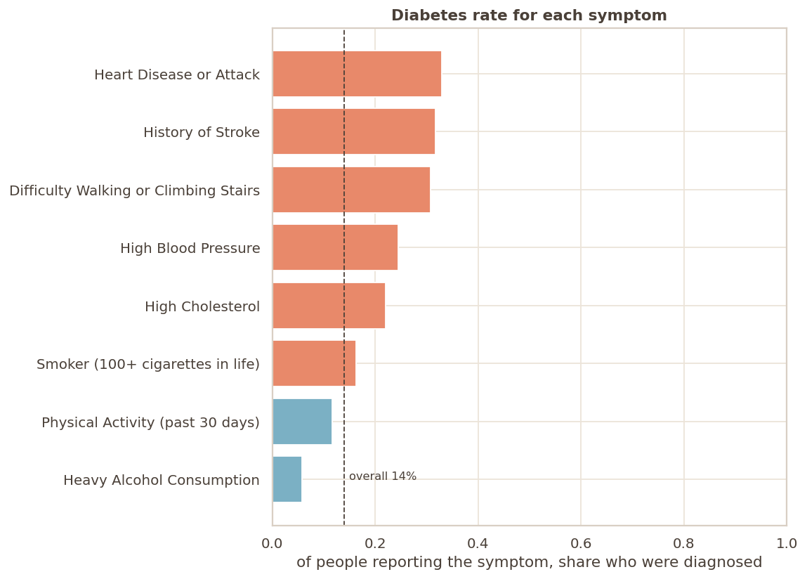
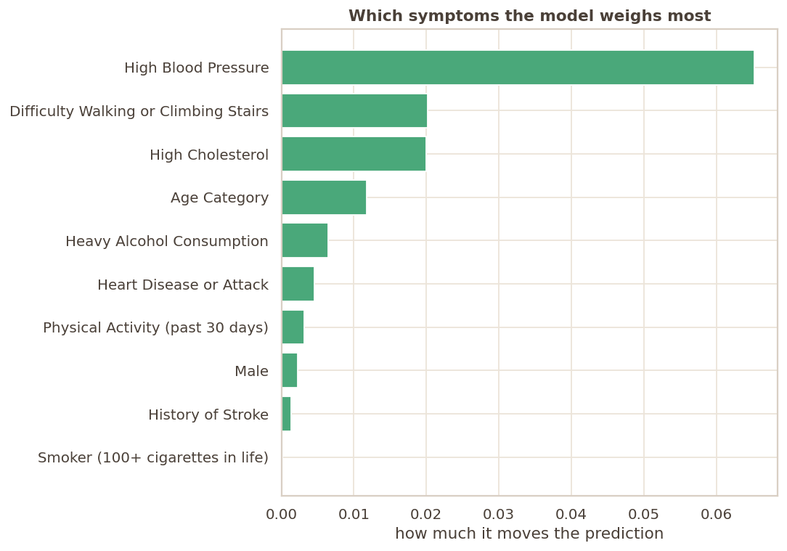

# Diabetes Risk Prediction

<p align="center">
  
</p>

This project is a web application that predicts a patient's risk of diabetes based on various health metrics and lifestyle factors. It uses a machine learning model trained on the widely trusted **CDC BRFSS (Behavioral Risk Factor Surveillance System)** data. 

## The Dataset

To ensure realistic and generalizable predictions, the model was trained carefully to mitigate overfitting. 

* **Size:** Over 250,000 patients
* **Target:** 14% of the patients in the dataset were diagnosed with diabetes.
* **Features:** Started with 21 features and 2 classes.
* **Overfitting Mitigation:** We explicitly dropped "leaky" symptoms (such as polyuria) to prevent the model from artificially learning the answers and overfitting the data.

### Lifestyle Indicators
The model evaluates risk based on core lifestyle and health indicators:
- High Blood Pressure
- High Cholesterol
- BMI / Physical Activity
- Smoking History & Heavy Alcohol Consumption
- History of Stroke & Heart Disease
- Difficulty Walking
- Age & Demographics

## Model Evaluation & Performance

We emphasize **honest and realistic** evaluation over artificially inflated numbers. 

Using an **80/20 stratified split** and **5-fold cross-validation** (CV ROC-AUC: 0.779 ± 0.001), the model proves to be stable and not just a "lucky split."

| Metric | Logistic Regression | Random Forest |
| ------ | ------------------- | ------------- |
| **Accuracy** | 85.9% | 86.2% |
| **ROC-AUC** | 0.776 | 0.780 |
| **Precision**| 46.7% | 46.5% |
| **Recall**   | 7.3%  | 7.3%  |

*Note: The Random Forest model overfits for a negligible +0.3% gain. The Logistic Regression model was chosen as it provides robust, generalizable predictive power while being interpretable.*

## Visualizations

We explored the data deeply using Python to understand the underlying drivers of diabetes risk.

<p align="center">
  
  
</p>

- **High Blood Pressure and High Cholesterol** stand out as the top drivers for diabetes.
- The Logistic Regression weights strongly emphasize **High Blood Pressure, Difficulty Walking, and High Cholesterol**.

## Project Structure

- **Backend (`/backend`)**: A FastAPI application that serves the ML model and provides REST API endpoints.
- **Frontend (`/frontend`)**: A React application built with Vite and TypeScript offering a sleek, interactive dashboard for checking risk estimates.

## Running the Application Locally

You can launch both the backend API and the frontend dashboard simultaneously using the provided script. From the project root, run:

```bash
./start.sh
```

This will start:
1. The FastAPI backend on `http://localhost:8000`.
2. The React frontend on `http://localhost:5173`.

To stop the application, simply press `Ctrl-C` in the terminal.

## API Endpoints

- `GET /health`: Health check endpoint.
- `GET /features`: Returns the required model features.
- `GET /metrics`: Returns model performance metrics.
- `GET /dataset`: Returns dataset statistics.
- `POST /predict`: Expects patient feature data and returns the probability and classified risk (e.g., "Routine monitoring" vs "Refer for a fasting blood glucose test soon").
